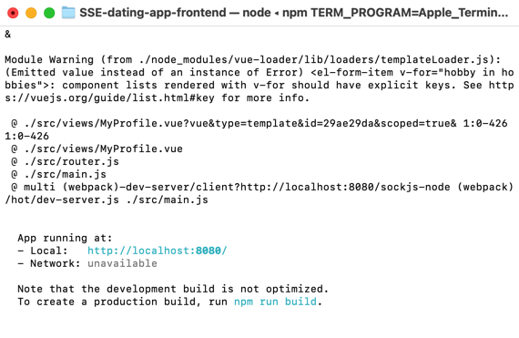

1. Please start the backend server before starting the frontend program
2. Please use Node v.14.20.1
3. Run `npm run serve` to start the frontend (The first time of running takes around 5 minutes to compile)
4. After compiling successfully, you will see the follow information: 
    
5. Then use chrome to run the frontend application using the URL: `http://localhost:8080`